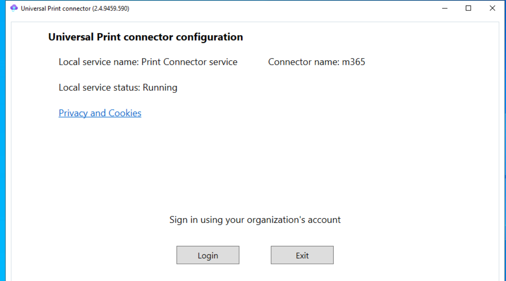
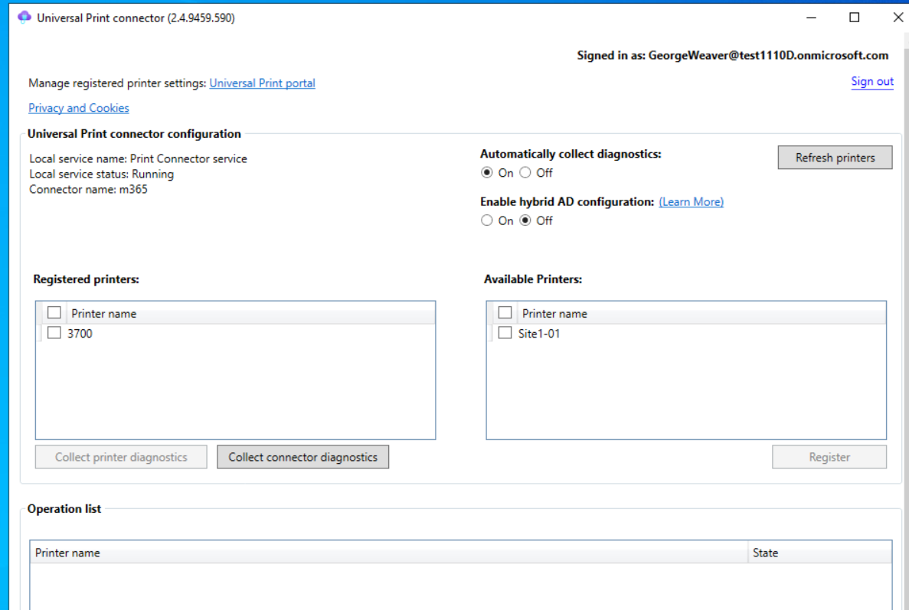

**Problem #1**
How to alow users to add printers them selfs. Some enviornments will use a print sofware like print logic, which is asoftwar ethat goes on to of hte print sever and allows user sto search for printer.

    options: for adding printer
    1) you can do settings > printers> add printers, but this pulls every printer in the network.
    2) you can do \\prtsvr\Printer, but thats not really self server.
    3) you can use a Group policy objectt to auto maticaly install printers by location.
    4) push printing up to windows universal print server. This moves the printing to the MS cloud, but has 2 requirements. First it requires a e3,e5 or standalone license., and it limits your printing to 100 print jobs a month

    steps:
        1) install the Universla Print connector on the print server
        
        
        2) register printers
        

        3) 
    5) run script about 3 minutes afte rinstall, which gets the computer IP address and instale
    5) create a ms logci app that get sa list of the aiavlbe printer and alows hte user to choose thiers

        steps:
        1) run an autmated flow that will pull printer objects from printers nad add them to a shar epoint list
        2) ahve a datavser app that pulls lat list and include a option toull it

Problem 2
Allow users to install approved programs by themselves

1) confirm that your ITSM is registered a san app ( in this case I'm using power AUtomate)
2) 
