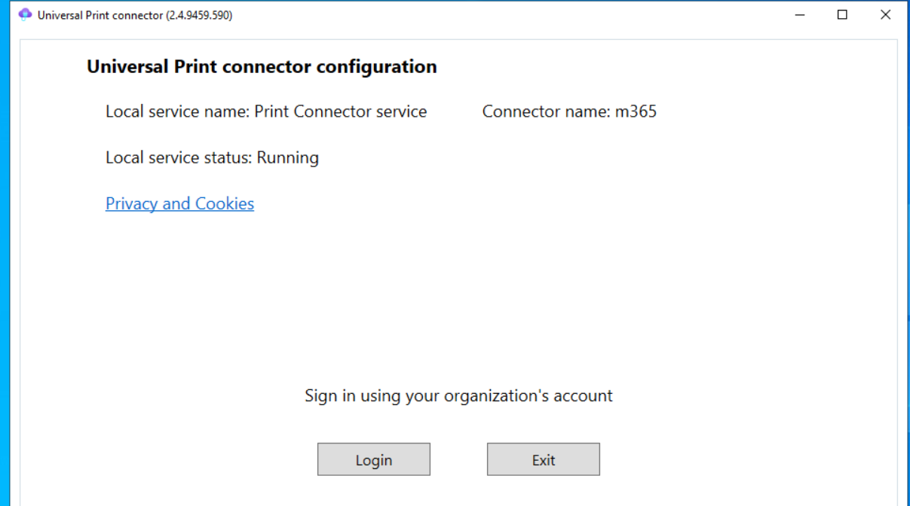
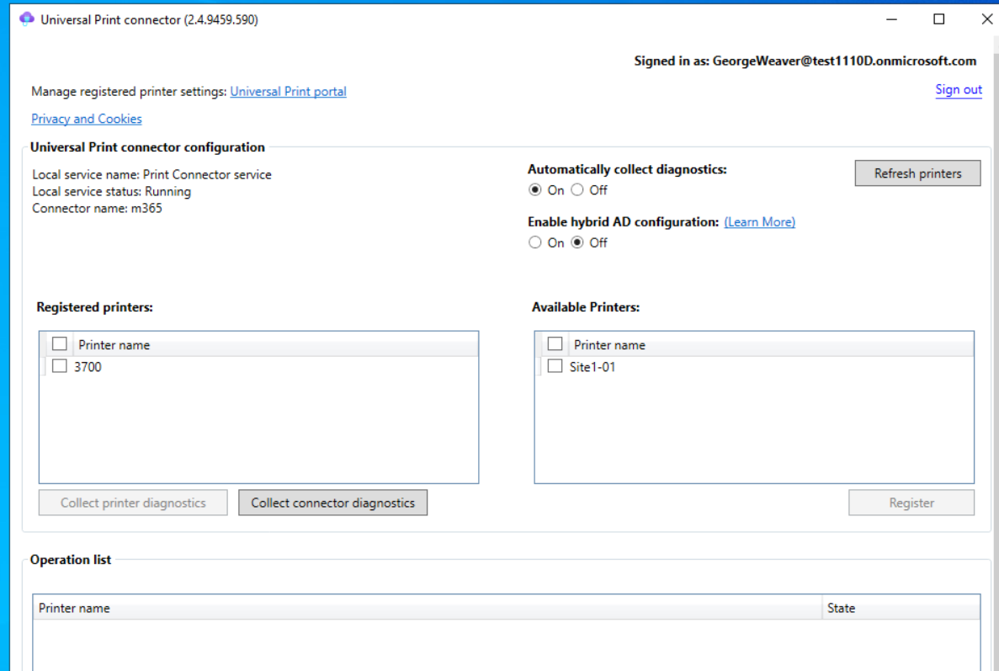

**Problem #1: How to allow users that travel to install network printers by them selves **  

Current Options:
1) Opening setting and selecting printers:
This will pull every printer on the nework
   

   
 2) Open  the network path \\prtsvr\Printer and select the printer
 users often dont know the name of the printer

 3) Use a GPO to automaticaly install printers by location
   Requires AD sites to be setup with

   [needs image]
   
   **Add Printers to Windows universal print server**
   This moves the printing to the MS cloud, but has 2 requirements. First it requires a e3,e5 or standalone license., and it limits your printing to 100 print jobs a month

    Steps:
   a) install the Universla Print connector on the print server
        
    b)  register printers
    

4) Create and deploy 2 scripts that will a) monitor the print server(s) for any updates and update a .csv file with those changes and b) Add a desktop shortcut in a folder for each printer in the building.
    ServerUpdate.ps1 : checks the printer for all of its printers and get the name, location, and creates a UNC path
    DesktopPrinterScript.ps1 : get the computers IP address, checkls it  again the network page to determine the subnet its on, and checks that location against
    locations in _ServerUpdate.ps1_ for any matches. Desktop shortcuts are created for each match.
      
5) Deploy the Printers to the Intune company Portal as Win 32 apops
6) Create a ms logic app that get sa list of the aiavlbe printer and alows hte user to choose thiers

