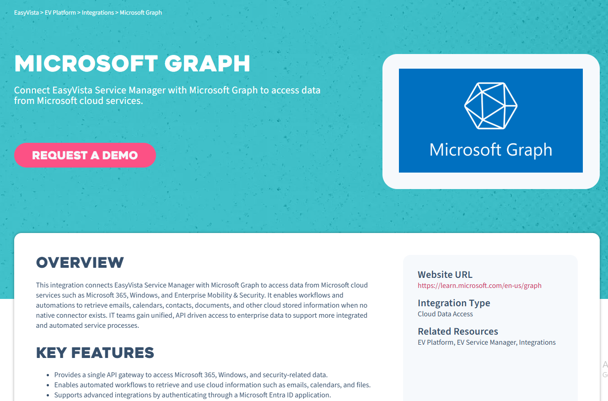

easy vista connections to MIcrosopft graph

1) the use case exists

2) preparation
https://docs.easyvista.com/v1/docs/microsoft-graph-integration#use-case
https://docs.easyvista.com/docs/microsoft-azure-integration-create-an-app-with-api-permissions

test lab example

tasks:
https://learn.microsoft.com/en-us/graph/azuread-users-concept-overview
-add/remmove licenses
- Add users to groups dynamically by matching specific attributes, 